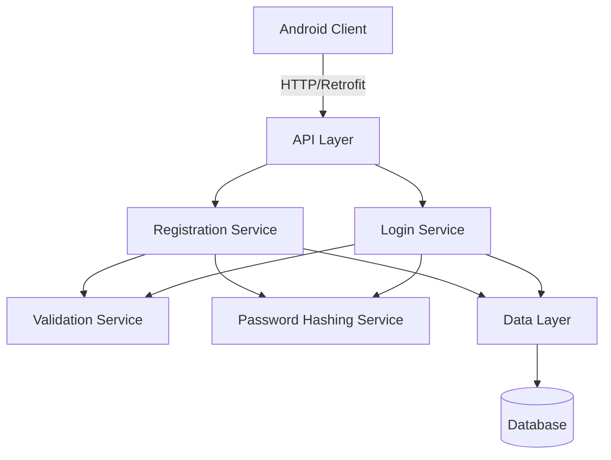

# Design Document: User Authentication

## Overview

This design describes a minimal user authentication system for a delivery backend application. The system provides two core capabilities: user registration and user login. It integrates with an existing Android Kotlin application that uses Retrofit for API communication.

The authentication system is built around a simple REST API with two endpoints:
- POST /register - Creates new user accounts
- POST /login - Authenticates existing users

The design prioritizes simplicity and security, focusing only on the essential functionality needed for basic authentication without additional features like password reset, email verification, or session management.

## Architecture

The system follows a standard three-layer architecture:

1. **API Layer**: REST endpoints that receive HTTP requests from the Android client
2. **Service Layer**: Business logic for registration, login, and validation
3. **Data Layer**: Database persistence for user entities



The architecture maintains clear separation between concerns:
- API layer handles HTTP protocol and request/response formatting
- Service layer implements business rules and orchestrates operations
- Data layer abstracts database operations

## Components and Interfaces

### API Layer

**Registration Endpoint**
```
POST /register
Content-Type: application/json

Request Body:
{
  "fullName": string,
  "username": string,
  "email": string,
  "password": string
}

Success Response (201):
{
  "success": true,
  "userId": string,
  "message": "User registered successfully"
}

Error Response (400):
{
  "success": false,
  "error": string
}
```

**Login Endpoint**
```
POST /login
Content-Type: application/json

Request Body:
{
  "username": string,
  "password": string
}

Success Response (200):
{
  "success": true,
  "user": {
    "id": string,
    "fullName": string,
    "username": string,
    "email": string
  }
}

Error Response (400/401):
{
  "success": false,
  "error": string
}
```

### Service Layer

**RegistrationService**
- `registerUser(fullName, username, email, password)`: Creates new user account
- Returns user ID on success or throws validation/conflict errors

**LoginService**
- `authenticateUser(username, password)`: Verifies credentials
- Returns user data on success or throws authentication errors

**ValidationService**
- `validateRegistrationInput(fullName, username, email, password)`: Validates registration data
- `validateLoginInput(username, password)`: Validates login data
- `validateEmailFormat(email)`: Checks email format
- Throws validation errors with specific messages

**PasswordHashingService**
- `hashPassword(plainPassword)`: Hashes password for storage
- `verifyPassword(plainPassword, hashedPassword)`: Verifies password against hash
- Uses bcrypt or similar secure hashing algorithm

### Data Layer

**UserRepository**
- `createUser(userData)`: Persists new user entity
- `findByUsername(username)`: Retrieves user by username
- `findByEmail(email)`: Retrieves user by email
- `existsByUsername(username)`: Checks username uniqueness
- `existsByEmail(email)`: Checks email uniqueness

## Data Models

### User Entity

```
User {
  id: UUID (primary key, auto-generated)
  fullName: String (required, non-empty)
  username: String (required, unique, non-empty)
  email: String (required, unique, valid format)
  passwordHash: String (required, hashed)
  createdAt: Timestamp (auto-generated)
}
```

**Constraints:**
- `username` must be unique across all users
- `email` must be unique across all users
- `passwordHash` stores only hashed passwords, never plain text
- `password` minimum length: 6 characters (enforced before hashing)

### Request/Response DTOs

**RegistrationRequest**
```
{
  fullName: String
  username: String
  email: String
  password: String
}
```

**LoginRequest**
```
{
  username: String
  password: String
}
```

**UserResponse**
```
{
  id: String
  fullName: String
  username: String
  email: String
}
```

Note: Password hash is never included in responses.


## Correctness Properties

*A property is a characteristic or behavior that should hold true across all valid executions of a system—essentially, a formal statement about what the system should do. Properties serve as the bridge between human-readable specifications and machine-verifiable correctness guarantees.*

### Property 1: Username Uniqueness

*For any* registered username, attempting to register another user with the same username should fail with an error indicating the username is already taken.

**Validates: Requirements 1.2, 2.2**

### Property 2: Email Uniqueness

*For any* registered email address, attempting to register another user with the same email should fail with an error indicating the email is already registered.

**Validates: Requirements 1.3, 2.3**

### Property 3: Password Hashing Round-Trip

*For any* user registration with a valid password, the system should store the password in hashed form (not plain text), and subsequent login with the original password should succeed, demonstrating that the hash verification works correctly.

**Validates: Requirements 1.4, 2.4, 6.1, 6.2**

### Property 4: Successful Registration

*For any* valid registration request with unique username and email, the system should create a new user and return a success response containing a user identifier.

**Validates: Requirements 2.1, 2.5**

### Property 5: Non-Existent Username Login Failure

*For any* username that has not been registered, attempting to login with that username should fail with an authentication error.

**Validates: Requirements 3.2**

### Property 6: Incorrect Password Login Failure

*For any* registered user, attempting to login with an incorrect password should fail with an authentication error.

**Validates: Requirements 3.3**

### Property 7: Successful Login

*For any* registered user with valid credentials, login should succeed and return user information (id, fullName, username, email) without exposing the password hash.

**Validates: Requirements 3.1, 3.5**

### Property 8: Empty Field Validation for Registration

*For any* registration request where fullName, username, email, or password is empty or contains only whitespace, the system should reject the request with a validation error.

**Validates: Requirements 4.1, 4.2, 4.3, 4.5**

### Property 9: Invalid Email Format Validation

*For any* registration request with an email that does not match valid email format (missing @, invalid domain structure, etc.), the system should reject the request with a validation error.

**Validates: Requirements 4.4**

### Property 10: Password Length Validation

*For any* registration request with a password shorter than 6 characters, the system should reject the request with a validation error.

**Validates: Requirements 4.6**

### Property 11: Empty Field Validation for Login

*For any* login request where username or password is empty, the system should reject the request with a validation error.

**Validates: Requirements 5.1, 5.2**


## Error Handling

The system uses HTTP status codes and structured error responses to communicate failures:

### Error Categories

**Validation Errors (400 Bad Request)**
- Empty or whitespace-only required fields
- Invalid email format
- Password too short (< 6 characters)

Response format:
```json
{
  "success": false,
  "error": "Specific validation message"
}
```

**Conflict Errors (400 Bad Request)**
- Username already exists
- Email already registered

Response format:
```json
{
  "success": false,
  "error": "Username already taken" | "Email already registered"
}
```

**Authentication Errors (401 Unauthorized)**
- Username does not exist
- Incorrect password

Response format:
```json
{
  "success": false,
  "error": "Invalid credentials"
}
```

Note: For security, authentication errors do not distinguish between non-existent username and incorrect password in the response message.

**Server Errors (500 Internal Server Error)**
- Database connection failures
- Unexpected exceptions

Response format:
```json
{
  "success": false,
  "error": "Internal server error"
}
```

### Error Handling Strategy

- All validation occurs before database operations
- Database constraint violations (unique username/email) are caught and converted to user-friendly error messages
- Password hashing failures are treated as server errors
- All errors are logged server-side with appropriate detail for debugging
- Client-facing error messages never expose internal implementation details

## Testing Strategy

The authentication system requires comprehensive testing using both unit tests and property-based tests to ensure correctness and security.

### Property-Based Testing

Property-based tests validate universal properties across many generated inputs. Each correctness property defined in this document must be implemented as a property-based test.

**Testing Library**: Use a property-based testing library appropriate for the implementation language (e.g., fast-check for JavaScript/TypeScript, Hypothesis for Python, QuickCheck for Haskell, junit-quickcheck for Java).

**Configuration**:
- Each property test must run a minimum of 100 iterations
- Each test must include a comment tag referencing the design property
- Tag format: `Feature: user-authentication, Property {number}: {property_text}`

**Property Test Coverage**:
1. Username uniqueness across random registration attempts
2. Email uniqueness across random registration attempts
3. Password hashing round-trip with random passwords
4. Successful registration with random valid data
5. Login failure with random non-existent usernames
6. Login failure with random incorrect passwords
7. Successful login with random valid credentials
8. Empty field rejection with random whitespace combinations
9. Invalid email format rejection with random malformed emails
10. Password length validation with random short passwords
11. Empty login field rejection

### Unit Testing

Unit tests complement property tests by verifying specific examples, edge cases, and integration points.

**Focus Areas**:
- Specific validation examples (e.g., email format: "test@example.com" valid, "invalid" invalid)
- Edge cases (e.g., password exactly 6 characters, username with special characters)
- Error message accuracy (e.g., "Username already taken" vs "Email already registered")
- API endpoint integration (request parsing, response formatting)
- Database operations (user creation, queries, constraint handling)
- Password hashing service (bcrypt configuration, hash verification)

**Example Unit Tests**:
- Registration with valid data returns 201 with user ID
- Registration with duplicate username returns 400 with specific error
- Login with correct credentials returns 200 with user data
- Login response excludes password hash
- Empty fullName returns validation error
- Email "user@domain.com" passes validation
- Email "notanemail" fails validation
- Password "12345" fails length validation
- Password "123456" passes length validation

### Testing Balance

- Property tests handle comprehensive input coverage through randomization
- Unit tests handle specific examples and integration verification
- Together they provide confidence in both general correctness and specific behaviors
- Avoid writing excessive unit tests for cases already covered by property tests

### Test Data Management

- Use in-memory database or test database for integration tests
- Clean database state between tests
- Generate random test data for property tests
- Use fixed test data for unit tests to ensure reproducibility
- Never use production data in tests

